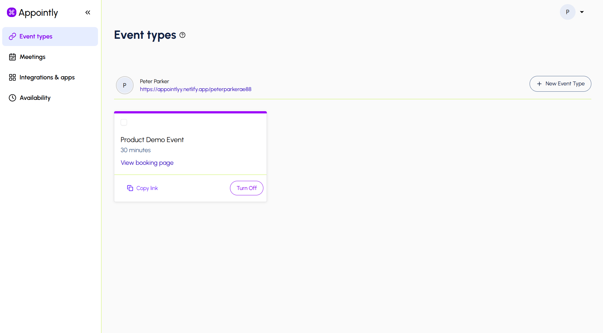
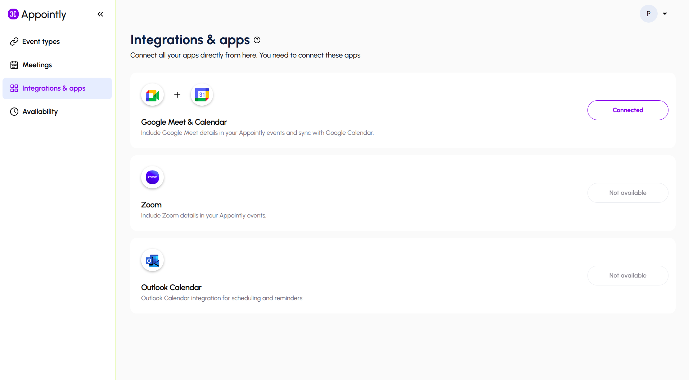
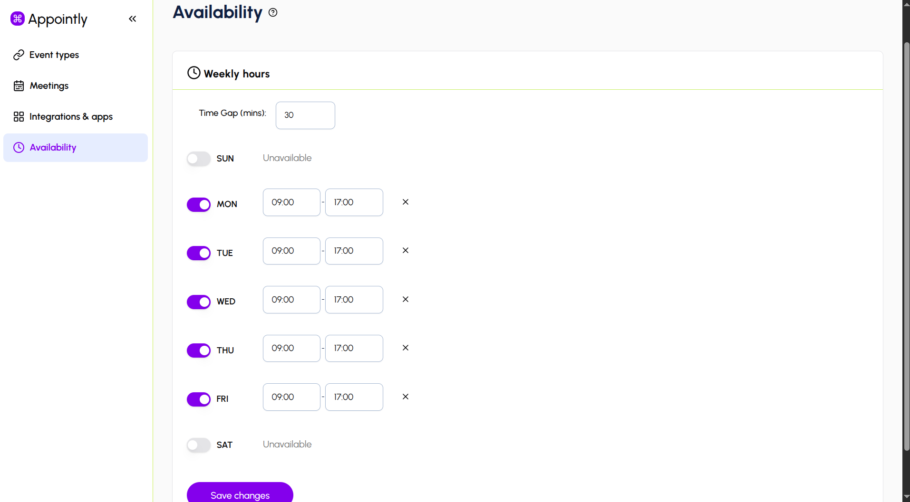
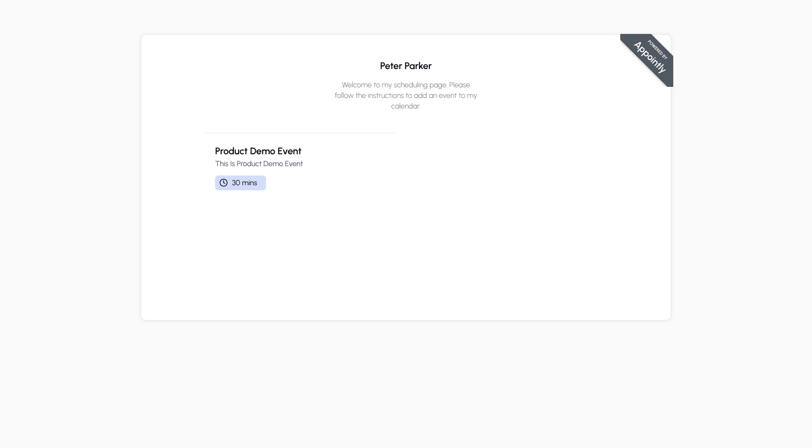
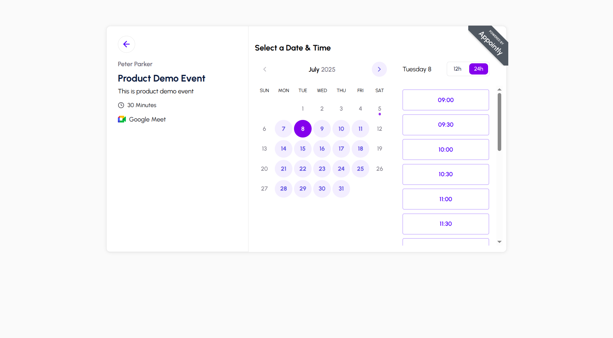
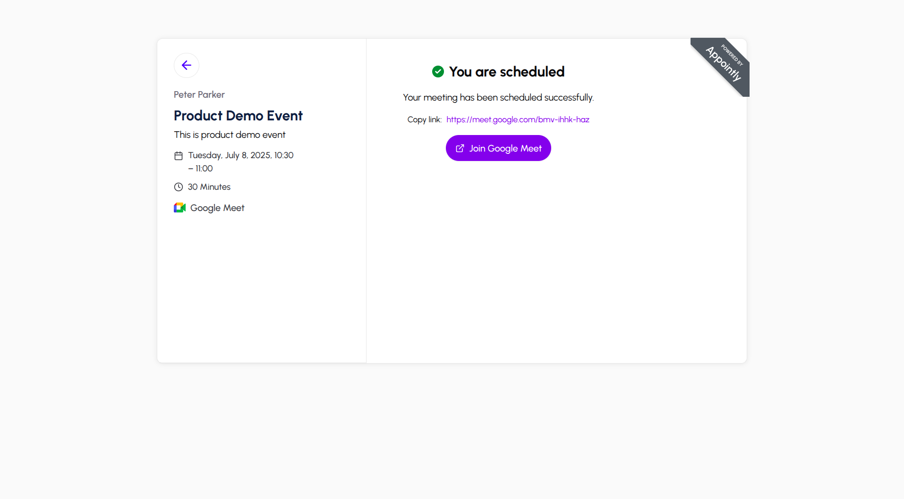
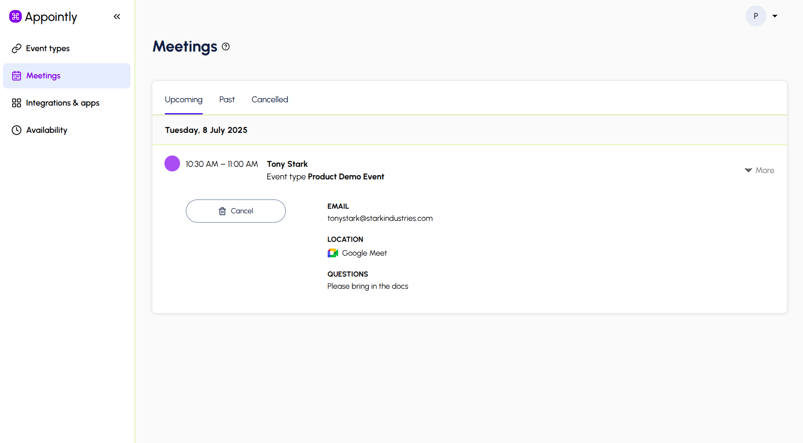
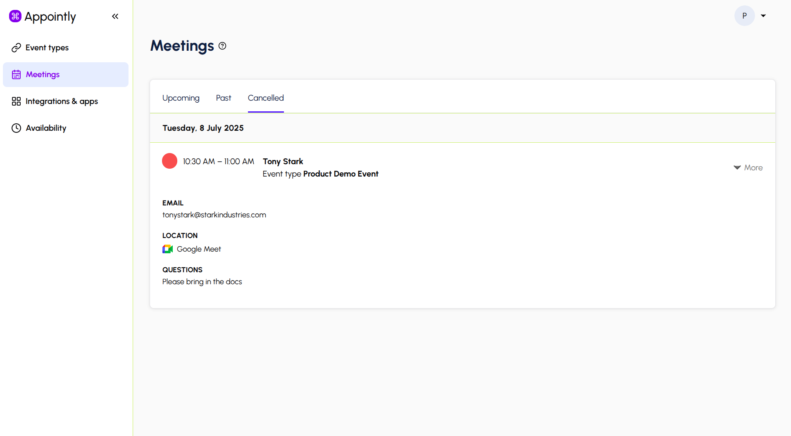

# 📅 Appointly

**Appointly** is a full-featured scheduling web app (like Calendly) that helps individuals and teams manage meetings effortlessly. Users can define availability, generate shareable booking links, and integrate with Google Calendar and Google Meet — all through a sleek, modern interface.

---

## 🚀 Live Demo

- 🔗 Frontend: [https://appointlyy.netlify.app/](https://appointlyy.netlify.app/)

---

## 🧪 Test User Credentials

You can log in with the following demo account:

- **Email:** `demo@appointly.com`
- **Password:** `Demo@1234`

---

## 💻 Tech Stack

| Layer      | Technology                               |
| ---------- | ---------------------------------------- |
| Frontend   | React 18 (with TypeScript), Tailwind CSS |
| Backend    | Node.js, Express.js, TypeScript          |
| ORM        | TypeORM                                  |
| Database   | Supabase PostgreSQL                      |
| Auth       | JWT, Passport.js, Google OAuth           |
| Scheduling | Date-fns, Timezone support               |
| Dev Tools  | ts-node-dev, dotenv,                     |

---

## ✨ Features

- ✅ User Registration & Login
- 🔐 JWT Authentication
- 📅 Create & Share Availability Slots
- 🔗 Unique Booking Links for Guests
- 📆 Google Calendar Sync
- 📹 Auto-create Google Meet links for meetings
- 🕒 Timezone-aware scheduling
- 📩 Email notifications
- 📱 Fully responsive design

---

## 🖼️ Screenshots

### 🔐 Events Page

### 🔐 Integrations Page

### 🔐 Availability Page

### 🔐 Schedule Page

### 🔐 Calendar Page

### 🔐 Meeting Scheduled Page

### 🔐 Upcoming Meeting Page

### 🔐 Cancelled Meeting Page

